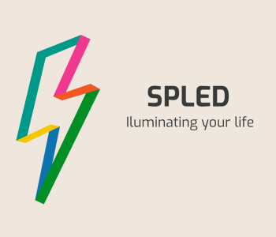

# SPLED: Software Product Line Engineering Demo

This demo repository contains a tiny but fully fledged [SPL](https://en.wikipedia.org/wiki/Software_product_line) for SW development. It is capable of holding a set of software modules that are differently used and configured among the variants. Each variant creates its own binaries.

## CI (Continuous Integration)

* 
* artifacts are archived under Github Actions (or locally inside the `build/<variant>/(prod|test)` directory)

## Preparation

You can install required tools and install some VS Code extensions. The installer uses Scoop/PowerShell, so it will only run on Windows. The installation is done by executing `install-mandatory.bat`. In case you are sitting behind a proxy server, make sure to add:
