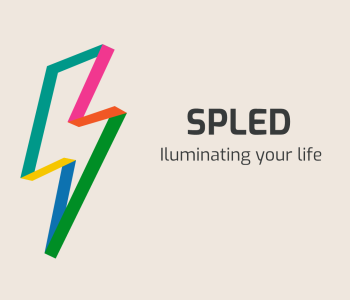

# SPLED: Software Product Line Engineering Demo



This demo repository contains a tiny but fully fledged [SPL](https://en.wikipedia.org/wiki/Software_product_line) for SW development. It is capable of holding a set of software modules that are differently used and configured among the variants. Each variant creates its own binaries.

* [](https://github.com/avengineers/SPLed/actions/workflows/ci.yml)
* artifacts are archived under GitHub Actions (or locally inside the `build/<variant>/(prod|test)` directory)

## Start developing

SPLed builds on **Windows** (`build.ps1`) and **Linux** (`build.sh`). The two scripts are peers —
same steps, same outputs — so pick the path that matches your environment.

### Windows

```powershell
.\build.ps1 -install
```

It is recommended to run the install command every time you switch between different branches,
because dependencies and their versions might have been updated.

It is recommended to start VS Code using the `build.ps1` script to make sure all dependencies and
environment variables are properly configured.

```powershell
.\build.ps1 -startVSCode
```

### DevContainer / DevPod / Codespaces (recommended on Linux)

The repository ships a devcontainer (`.devcontainer/`) with the full toolchain baked into the image.
Open the folder in VS Code ("Reopen in Container"), run `devpod up .`, or start a Codespace — the
container's `onCreateCommand` runs `./build.sh --install` for you, so Python, Poetry, CMake, Ninja and
the compilers are on `PATH` in every terminal with no manual setup.

### Bare Linux host (e.g. WSL Ubuntu)

Provision the OS-level prerequisites once per machine, then install as usual:

```bash
sudo ./bootstrap_ubuntu.sh    # apt packages
./bootstrap_python.sh         # uv, CPython 3.11, Poetry (into ~/.local)
# open a fresh shell (or `source ~/.bashrc`) so ~/.local/bin is on PATH
./build.sh --install
```

The devcontainer image runs these same two scripts at build time, so container and bare host are
provisioned from one source of truth.

## Building a variant

```powershell
.\build.ps1 -build                       # interactive variant selection
.\build.ps1 -build -variants Disco
.\build.ps1 -build -buildKit test -buildType Debug
```

```bash
./build.sh --build --variant Disco
./build.sh --build --build-kit test --build-type Debug --variant Sleep
./build.sh --help                        # full flag list
```

Note the flag vocabulary differs slightly between the two scripts (`-variants` / `--variant`,
`-buildKit` / `--build-kit`); `--help` is authoritative for Bash.

## Testing & Quality Gates

Tests are executed using pytest with a two-dimensional marker strategy combining *type markers*
(WHAT to test) and *gate markers* (WHEN to test). The CI pipeline automatically selects the right
quality gate based on the build context and runs the suite on Windows, Linux, and inside the
devcontainer.

For the full testing strategy, marker definitions, and the gate assignment matrix, see
[Testing Strategy](doc/testing_strategy.md).

```powershell
# Run all tests for a specific gate
.\build.ps1 -selftests -marker "gate_develop_pr"

# Filter by variant
.\build.ps1 -selftests -filter "Disco" -marker "gate_develop_push"
```

```bash
./build.sh --selftests --marker gate_develop_pr
./build.sh --selftests --filter Disco --marker gate_develop_push
```

## Developer Guide

For more information about the architecture, workflows, and conventions, see [AGENTS.md](AGENTS.md). This guide covers:

- Critical developer workflows (environment setup, building, testing)
- SPL-specific CMake patterns and KConfig feature system
- VS Code CMake extension configuration
- Component structure and integration points
