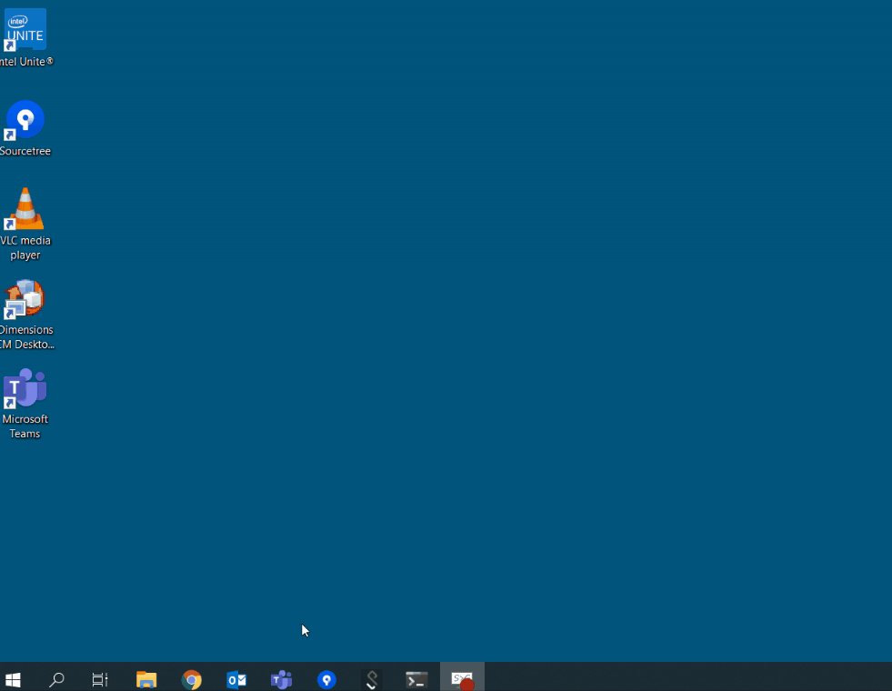
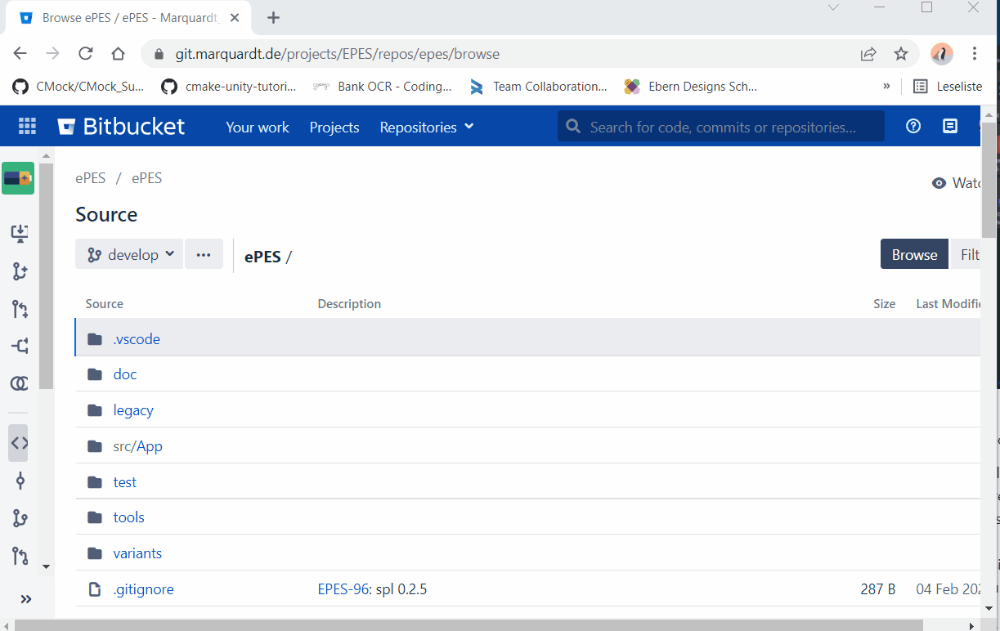

# Software Product Line "ePES"

In this repository we construct the &lt;SPL&gt; ePES.

## CI (Continuous Integration)

* Find the latest CI results of default branch 'develop' [here](http://jenkins.marquardt.de:8080/job/EPES/job/ePES/job/epes/job/develop/lastCompletedBuild/).
* An overview of all CI build results can be found [here](http://jenkins.marquardt.de:8080/job/EPES/job/ePES/job/epes/).

## Preparation

In order to work with this repository you must

* Clone it first:
Therefore you must first install a Git client, e.g. Sourcetree:

and then click on the `clone` button on the left hand side.
Clone it in any directory you like on your local disk, there are no path constraints (putting it to the synced user profile will work, but is not recommended). 

* Install mandatory tools by executing `install-mandatory.bat` in the root directory of the repository.
* In case you want to use Visual Studio Code you might want to install the optional tools, too by executing `install-optional.bat` in the root directory of the repository.
  * In VS Code you need to install the following extensions. Hit `Ctrl+Shift+x` to search and install them.
    * CMake Tools
    * C/C++ Extension Pack

## Contributing

For any contribution please refer to the [contribution guide](https://docs.marquardt.de/x/FAAfBg).

## Import new Dimension Projects (as legacy sources)

Importing is only possible in commandline mode. By running `build.bat` you will take a Make project from Dimensions (from local disk) and you can automatically bring it into SPL structure. [see details here](doc/import.md)

## Legacy Sources to Configurable Sources

The imported sources will be part of the legacy/ folder and placed there in the same structure as they were in Dimensions. They are not fully transformed into the new `configurable sources` structure. It needs some manual effort to change the code accordingly. [see details here](doc/legacyToConfigurable.md)

## TDD (Test Driven Development) and Unit Testing

In order do develop software using TDD, you need to [write and run unit tests](doc/unitTesting.md).

## Debugging

In case your unit tests are not sufficient enough and a bug was found that is not covered by an automated test, you can also debug your software. By stepping through your software units code line-by-line, you can see its behavior on your PC. [see details here](doc/debugging.md)

## Build Binaries

In order to build the project's binaries you have two options: Visual Studio Code or command line interface, preference: Visual Studio Code. [see details here](doc/build.md)
