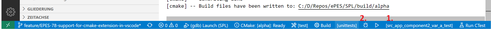
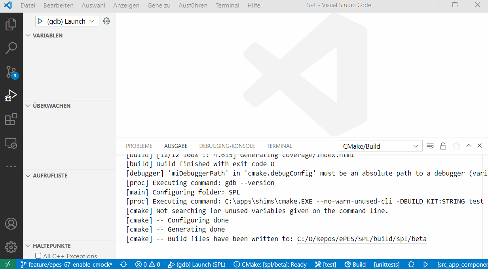

# Debugging

For this step it is only recommended to use Visual Studio Code.

This is very similar to running the tests. In fact building a test executable is a prerequisite for this step. So make sure to first build a test executable like _src_app_component_var_a_test_ or just **all** with target 'unittests'.

If the executable is available you can again go to the blue ribbon and (1) select your test executable and then (2) start debugging it. It will automatically stop in the main function, even if no breakpoint is set:

